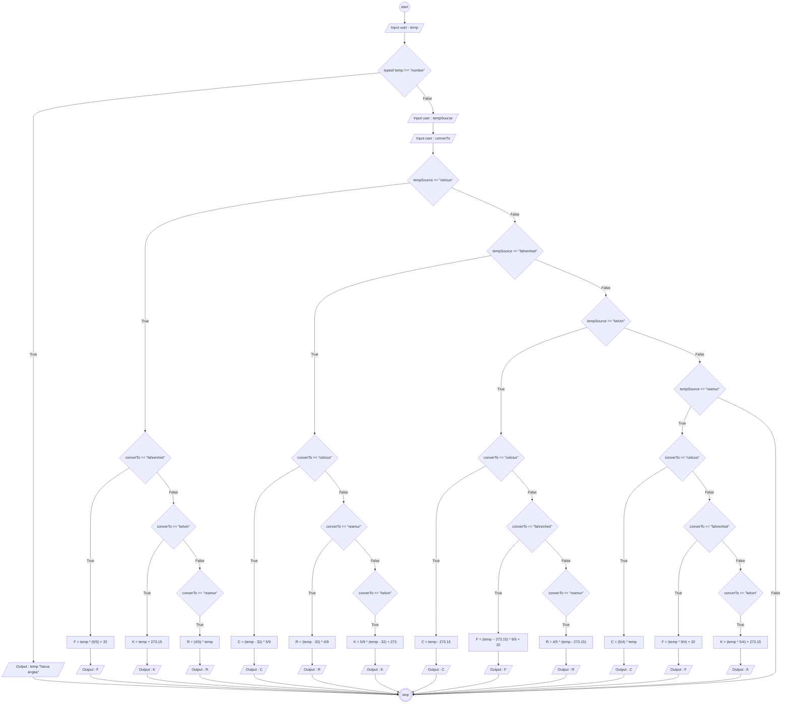

```mermaid
flowchart
  start@{shape: circle }

  inputTemp@{shape: lean-r, label : 'Input user : temp'}
  isNumber@{shape: diamond, label: 'typeof temp !== "number"'}

  harusAngka@{shape: lean-r, label : 'Output : temp "harus angka"'}

  inputSource@{shape: lean-r, label : 'Input user : tempSource'}
  inputTarget@{shape: lean-r, label : 'Input user : converTo'}

  isCelcius@{shape: diamond, label : 'tempSource == "celcius"'}
  targetFahrenheit@{shape : diamond, label : 'converTo == "fahrenheit"'}

  processF@{shape: rect, label : 'F = temp * (9/5) + 32'}
  outputF@{shape: lean-r, label : 'Output : F'}

  stop@{shape : dbl-circ}

  isFahrenheit@{shape: diamond, label : 'tempSource == "fahrenheit"'}
  targetCelcius@{shape : diamond, label : 'converTo == "celcius"'}
  processC@{shape: rect, label : 'C = (temp - 32) * 5/9'}
  outputC@{shape: lean-r, label : 'Output : C'}

  cToK@{shape: diamond, label : 'converTo == "kelvin"'}
  proccesCtoK@{shape : rect, label : 'K = temp + 273.15'}
  outputCtoK@{shape: lean-r, label : 'Output : K'}

  cToR@{shape: diamond, label : 'converTo == "reamur"'}
  proccesCtoR@{shape : rect, label : 'R = (4/5) * temp'}
  outputCtoR@{shape: lean-r, label : 'Output : R'}

  fToR@{shape: diamond, label : 'converTo == "reamur"'}
  proccesFtoR@{shape : rect, label : 'R = (temp - 32) * 4/9'}
  outputFtoR@{shape: lean-r, label : 'Output : R'}

  fToK@{shape: diamond, label : 'converTo == "kelvin"'}
  proccesFtoK@{shape : rect, label : 'K = 5/9 * (temp - 32) + 273'}
  outputFtoK@{shape: lean-r, label : 'Output : K'}

  tempK@{shape: diamond, label : 'tempSource == "kelvin"'}

  kToC@{shape: diamond, label : 'converTo == "celcius"'}
  proccesKtoC@{shape : rect, label : 'C = temp - 273.15'}
  outputKtoC@{shape: lean-r, label : 'Output : C'}

  kToF@{shape: diamond, label : 'converTo == "fahrenheit"' }
  proccesKtoF@{shape : rect, label : 'F = (temp − 273.15) * 9/5 + 32'}
  outputKtoF@{shape: lean-r, label : 'Output : F'}

  kToR@{shape: diamond, label : 'converTo == "reamur"' }
  proccesKtoR@{shape : rect, label : 'R = 4/5 * (temp - 273.15)'}
  outputKtoR@{shape: lean-r, label : 'Output : R'}

  tempR@{shape: diamond, label : 'tempSource == "reamur"'}

  rToC@{shape: diamond, label : 'converTo == "celcius"' }
  proccesRtoC@{shape : rect, label : 'C = (5/4) * temp '}
  outputRtoC@{shape: lean-r, label : 'Output : C'}

  rToF@{shape: diamond, label : 'converTo == "fahrenheit"' }
  proccesRtoF@{shape : rect, label : 'F = (temp * 9/4) + 32 '}
  outputRtoF@{shape: lean-r, label : 'Output : F'}

  rToK@{shape: diamond, label : 'converTo == "kelvin"' }
  proccesRtoK@{shape : rect, label : 'K = (temp * 5/4) + 273.15 '}
  outputRtoK@{shape: lean-r, label : 'Output : K'}

  start --> inputTemp
  inputTemp --> isNumber
  isNumber --True--> harusAngka --> stop
  isNumber --False--> inputSource --> inputTarget --> isCelcius

  isCelcius --True--> targetFahrenheit
  targetFahrenheit --True--> processF --> outputF --> stop
  targetFahrenheit --False--> cToK
  cToK --True--> proccesCtoK --> outputCtoK --> stop
  cToK --False--> cToR
  cToR --True--> proccesCtoR --> outputCtoR --> stop

  isCelcius --False--> isFahrenheit
  isFahrenheit --True--> targetCelcius
  targetCelcius --True--> processC --> outputC --> stop
  targetCelcius --False--> fToR
  fToR --True--> proccesFtoR --> outputFtoR --> stop
  fToR --False--> fToK
  fToK --True--> proccesFtoK --> outputFtoK --> stop

  isFahrenheit --False--> tempK
  tempK --True--> kToC
  kToC --True--> proccesKtoC --> outputKtoC --> stop
  kToC --False--> kToF
  kToF --True--> proccesKtoF --> outputKtoF --> stop
  kToF --False--> kToR
  kToR --True--> proccesKtoR --> outputKtoR --> stop

  tempK --False--> tempR
  tempR --True--> rToC
  rToC --True--> proccesRtoC --> outputRtoC --> stop
  rToC --False--> rToF
  rToF --True--> proccesRtoF --> outputRtoF --> stop
  rToF --False--> rToK
  rToK --True--> proccesRtoK --> outputRtoK --> stop

  tempR --False--> stop

```
