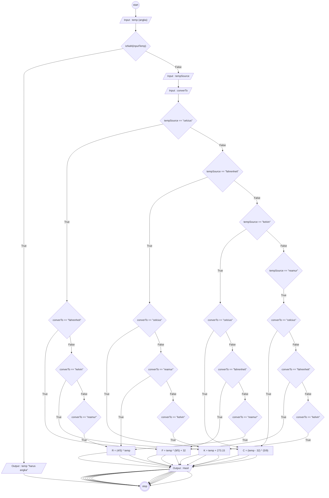

```mermaid
flowchart
  start@{shape: circle}

  inputTemp@{shape: lean-r, label: "Input : temp (angka)"}
  isNumber@{shape: diamond, label: 'isNaN(inputTemp)'}

  harusAngka@{shape: lean-r, label: 'Output : temp "harus angka"'}
  stop@{shape: dbl-circ}

  inputSource@{shape: lean-r, label: 'Input : tempSource'}
  inputTarget@{shape: lean-r, label: 'Input : converTo'}

  isCelcius@{shape: diamond, label: 'tempSource == "celcius"'}
  isFahrenheit@{shape: diamond, label: 'tempSource == "fahrenheit"'}
  isKelvin@{shape: diamond, label: 'tempSource == "kelvin"'}
  isReamur@{shape: diamond, label: 'tempSource == "reamur"'}

  cToF@{shape: diamond, label: 'converTo == "fahrenheit"'}
  cToK@{shape: diamond, label: 'converTo == "kelvin"'}
  cToR@{shape: diamond, label: 'converTo == "reamur"'}

  fToC@{shape: diamond, label: 'converTo == "celcius"'}
  fToR@{shape: diamond, label: 'converTo == "reamur"'}
  fToK@{shape: diamond, label: 'converTo == "kelvin"'}

  kToC@{shape: diamond, label: 'converTo == "celcius"'}
  kToF@{shape: diamond, label: 'converTo == "fahrenheit"'}
  kToR@{shape: diamond, label: 'converTo == "reamur"'}

  rToC@{shape: diamond, label: 'converTo == "celcius"'}
  rToF@{shape: diamond, label: 'converTo == "fahrenheit"'}
  rToK@{shape: diamond, label: 'converTo == "kelvin"'}

  processF@{shape: rect, label: 'F = temp * (9/5) + 32'}
  processC@{shape: rect, label: 'C = (temp - 32) * (5/9)'}
  processK@{shape: rect, label: 'K = temp + 273.15'}
  processR@{shape: rect, label: 'R = (4/5) * temp'}

  output@{shape: lean-r, label: 'Output : Hasil'}

  start --> inputTemp
  inputTemp --> isNumber

  isNumber -- True --> harusAngka --> stop
  isNumber -- False --> inputSource --> inputTarget --> isCelcius

  isCelcius -- True --> cToF
  cToF -- True --> processF --> output --> stop
  cToF -- False --> cToK
  cToK -- True --> processK --> output --> stop
  cToK -- False --> cToR
  cToR -- True --> processR --> output --> stop

  isCelcius -- False --> isFahrenheit
  isFahrenheit -- True --> fToC
  fToC -- True --> processC --> output --> stop
  fToC -- False --> fToR
  fToR -- True --> processR --> output --> stop
  fToR -- False --> fToK
  fToK -- True --> processK --> output --> stop

  isFahrenheit -- False --> isKelvin
  isKelvin -- True --> kToC
  kToC -- True --> processC --> output --> stop
  kToC -- False --> kToF
  kToF -- True --> processF --> output --> stop
  kToF -- False --> kToR
  kToR -- True --> processR --> output --> stop

  isKelvin -- False --> isReamur
  isReamur -- True --> rToC
  rToC -- True --> processC --> output --> stop
  rToC -- False --> rToF
  rToF -- True --> processF --> output --> stop
  rToF -- False --> rToK
  rToK -- True --> processK --> output --> stop
```
